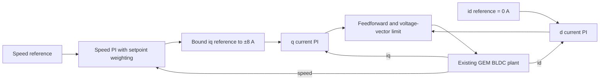

# Cascaded PI baseline — design, tuning and comparison protocol

**Date:** 2026-09-15 · **Controller:** `pi_cascaded` · **Evaluation protocol:** `bldc-cascaded-v1`.

## 1. Objective and scope

The earlier voltage PI controlled speed but did not directly regulate phase-current shape.
This controller adds two current PI regulators and makes the speed PI request q-axis current.
The BLDC plant remains in phase variables with its existing trapezoidal back-EMF; it is not replaced
by a sinusoidal PMSM model. This is a **nominal simulation baseline**, not a hardware-qualified drive.



FOC references support the use of rotating-frame current regulators and decoupling [C1].
Cascaded speed/torque control is described in [C2]. The specific BLDC approximation, gain choices,
setpoint weighting, acceptance thresholds and experiments below are **project design decisions**.
They are not claimed to reproduce the reference authors' tuning or hardware results.

## 2. Coordinate conventions and the torque factor

The GEM transform is amplitude-invariant. For balanced abc quantities,

\[
e_a i_a+e_b i_b+e_c i_c=\frac32(e_d i_d+e_q i_q). \tag{C1}
\]

The existing unit trapezoid's fundamental peak coefficient is `12/π²`. Its mean q-axis back-EMF
coefficient is therefore `Kef = (12/π²) Ke = 0.1161140765 V s/rad` for `Ke = 0.0955 V s/rad`.
With zero d-axis current, the average torque approximation used for outer-loop design is

\[
\overline T_e\simeq K_{tq}i_q,\qquad K_{tq}=\frac32K_{ef}=0.1741711147\;\mathrm{N\,m/A}. \tag{C2}
\]

This is the **sinusoidal q-current average torque constant**, not the six-step line-current constant
`2 Ke`. A numerical test integrates the actual BLDC torque law for unit sinusoidal q current over an
electrical cycle and confirms (C2). The older verification note omitted the `3/2` multiplier in its
torque-constant explanation; that text is corrected. This does not change any motor equations.

## 3. Inner current loop

For design only, treat each decoupled electrical axis as `G_i(s)=1/(Ls s + Rs)` [C1].
Choose an electrical PI `C_i(s)=Kpi+Kii/s` with

\[
K_{pi}=L_s\omega_c,\qquad K_{ii}=R_s\omega_c. \tag{C3}
\]

This cancels the nominal RL pole in the continuous approximation, giving
`C_i G_i = ωc/s`. The ideal closed-loop transfer is `ωc/(s+ωc)`.
This algebraic pole-cancellation derivation is local; it is not an assertion that the discrete,
saturated, trapezoidal-BEMF drive has that exact transfer function.

The implemented feedforward is

\[
u_{d,ff}=-\omega_eL_s i_q,\qquad
u_{q,ff}=\omega_eL_s i_d+K_{ef}\omega_m,\qquad \omega_e=p\omega_m. \tag{C4}
\]

It uses the fundamental back-EMF coefficient only. It does not read the plant's exact trapezoid
function, future states, disturbance schedule, or commanded load. The current loops must reject
the remaining harmonic back-EMF. Observations are the same SI state mapping available to the old baseline.

### Discrete update and voltage saturation

At each `Δt = 100 µs`, let `e_i = i* − i` and let `z_i` be the two integrator outputs in volts:

\[
u_{raw}=K_{pi}e_i+z_i+u_{ff},\quad
u=\operatorname{project}_{\|u\|\le U_{lim}}(u_{raw}), \tag{C5}
\]

\[
z_i^+=z_i+\Delta t\,[K_{ii}e_i+\omega_c(u-u_{raw})]. \tag{C6}
\]

This is a positional PI with forward-Euler integration and vector back-calculation anti-windup,
based on the anti-windup concepts in [C3]. Saturation acts on the complete dq voltage vector including
feedforward, not independently on each axis. The benchmark's existing normalized action disk is retained:
`Ulim = 0.12 × 44.4/2 = 2.664 V`; GEM receives `a = u/(44.4/2)`.
The current-reference vector is also projected to radius 8 A; the outer controller always requests `id*=0`.
These reference limits do not guarantee actual phase currents can never exceed a constraint.

## 4. Current-loop tuning evidence (before closing the speed loop)

Use a `ConstantSpeedLoad` at **0, 10 and 20 rad/s**, with the same electrical motor, solver and voltage bound.
This load replacement is confined to current-loop validation and is not used for the PI comparison.
Each 0.13 s test begins at zero current and applies `(id*,iq*)`:

| Time (s) | Reference (A) |
|---:|---|
| 0 | (0, 0) |
| 0.01 | (0, 1) |
| 0.04 | (1, 1) |
| 0.07 | (0, −1) |
| 0.10 | (0, 0) |

For each plateau after 0.01 s, combine its final 10 ms to compute vector error RMS and maximum
absolute axis error. The acceptance limits were encoded before running the first candidate:
vector RMSE `<0.2 A`, max axis error `<0.35 A`. At standstill also require rise `<2 ms`, settling
`<5 ms` with a 2% band/5 ms hold, and overshoot `<10%`. All cases must avoid environment termination.

| Design bandwidth | 20 rad/s tail vector RMSE | Max axis error | All current gates |
|---:|---:|---:|---|
| 800 Hz | 0.35352 A | 0.62209 A | Fail |
| 1200 Hz | 0.24967 A | 0.45167 A | Fail |
| 1600 Hz | 0.19090 A | 0.35244 A | Fail |
| **1800 Hz** | **0.17049 A** | **0.31731 A** | **Pass** |

All four candidates are retained, including failures. 1800 Hz is the first passing candidate in this
sequence, not a global optimum. The speed-comparison scenarios were not used to select it.
At standstill, the selected design settles within 2% in 0.2 ms with 4.01% sampled overshoot.
Its interpolated 10–90% value is 0.0769 ms, **shorter than one 0.1 ms sample**; do not present this as
a resolved measurement of sub-sample transient dynamics or a measured 1800 Hz closed-loop bandwidth.

**Latency limitation:** 1800 Hz is aggressive relative to a 10 kHz control rate. This benchmark has
an averaged converter and no additional sensor/computation/PWM delay. The design must be retuned and
stability margins checked when those delays/noise are introduced. It is not ready for FPGA deployment.

## 5. Outer speed loop

Approximate the controlled motor by `Gω(s)=Ktq/(Js+B)` using total assumed inertia
`J=0.003 kg m²` and viscous coefficient `B=0.01 N m s/rad`. Static friction and torque harmonics are
treated as disturbances. With damping `ζ=1` and desired natural frequency `ωn=2π×5 rad/s`, select

\[
K_{p\omega}=\frac{2\zeta\omega_nJ-B}{K_{tq}},\qquad
K_{i\omega}=\frac{J\omega_n^2}{K_{tq}}. \tag{C7}
\]

This places the approximate characteristic polynomial at `J(s²+2ζωn s+ωn²)`.
Setpoint weighting `β=0` applies the proportional term to measured speed and the integral term to
tracking error, eliminating the proportional setpoint kick and the numerator zero of the ideal
reference transfer. It does not ramp, filter or change the benchmark reference schedule.

\[
i_{q,raw}^*=K_{p\omega}(\beta\omega^*-\omega)+z_\omega,\qquad
i_q^*=\operatorname{clip}(i_{q,raw}^*,-8,8),\quad i_d^*=0. \tag{C8}
\]

After obtaining the inner-loop action, update `zω += Kiω Δt (ω*−ω)` unless either condition holds:

1. The current request is at/beyond its bound and the increment would push it farther outward.
2. The inner voltage saturates and `(ω*−ω)(iq*−iq)>0`, indicating that additional integral action
   would demand more current in the direction that is already unavailable.

This cascaded conditional-integration rule is a documented project choice, validated by saturation/release
tests. It does not infer an exact achievable torque from the inverter. Both loops execute every 100 µs;
their design bandwidths differ, rather than their scheduling rates. All integrators reset once per episode.

### Frozen gains

| Parameter | Value | Unit |
|---|---:|---|
| Current proportional gain | 0.5654866776 | V/A |
| Current integral gain | 961.3273520 | V/(A s) |
| Current back-calculation gain | 11309.73355 | 1/s |
| Speed proportional gain | 1.0248287125 | A/(rad/s) |
| Speed integral gain | 16.9998413672 | A/rad |
| Speed setpoint weight | 0 | dimensionless |
| q-current reference bound | ±8 | A |

These are analytically derived from `config_cascaded.json`, not unexplained hand-entered gain values.

## 6. Independent speed-stage checks

Before the frozen comparison:

- **Design case:** 0→8 rad/s at 0.05 s; add 0.04 N m at 0.6 s; end at 1.2 s. Require rise `<0.2 s`,
  settling `<0.4 s`, overshoot `<5%`, disturbance recovery `<0.2 s`, no constraint trip, bounded actions/reference.
  Observed rise 0.1063 s and settling 0.1860 s. The load perturbation remains within the 0.16 rad/s band,
  so reported recovery is 0 s; that means **no out-of-band excursion**, not instantaneous correction.
- **Saturation case:** 0→100 rad/s at 0.01 s, then 5 rad/s at 1.0 s; end at 2.5 s. The 100 rad/s request
  is deliberately unreachable with the common voltage bound. Require actual saturation, integrator freezing,
  no constraint trip, and recovery after release in `<0.6 s`. Observed release settling: 0.1953 s.

Both passed. The 5 Hz/critical-damping outer design was accepted without a speed-gain sweep.
The limits and results are retained in `results/bldc/speed-loop-v1`.

## 7. Fair paired evaluation and metrics

Run the original voltage PI and the new cascade with the **same** plant parameters, initial conditions,
seed, reference/load schedules, solver and radius-0.12 dq action bound. Original gains are unchanged.
The current-reference bound is internal to the cascade; its actual phase currents still face the
same GEM squared-current constraint. No perfect back-EMF map is supplied to the new controller.

The four frozen scenarios remain startup, speed steps, load step and load pulse from
[`bldc_benchmark.md`](bldc_benchmark.md). Existing speed/ripple/current/failure definitions are retained.
Added metrics are:

- dq tracking RMSE: `sqrt(mean((id−id*)²+(iq−iq*)²))`, whole run and final 0.2 s per complete segment.
  The original PI has no current references, so this metric is absent/null for it.
- Inner voltage-saturation and current-reference-limit fractions, distinct from evaluator projection.
- Selected phase-a harmonic ratio: least-squares DC and sin/cos terms in measured electrical angle at
  orders 1,3,5,7,9,11,13; `100 sqrt(A3²+A5²+...+A13²)/A1`. This is **not full-band THD**. Require at least
  one electrical cycle and `A1 ≥ 0.001 A`; otherwise return null.

Current references recorded on each row are those applied during that row's preceding interval;
current tracking compares the resulting post-step state to those references. Integrator states and
pre-step currents are logged separately. No trace is cosmetically changed to look sinusoidal.
Scientific plots show both controllers' phase currents on common amplitude limits and include dq reference tracking.
The replay selector labels each controller/scenario explicitly.

## 8. Requirements, tests and reproduction

| ID | Requirement | Evidence |
|---|---|---|
| C01 | Correct torque/current convention | Numerical cycle-average torque test |
| C02 | Explain and reproduce both loop gains | RL-pole cancellation and outer-pole tests; gain table |
| C03 | Correct feedforward signs and SI/action conversion | Feedforward test |
| C04 | Bound vectors and handle cascaded windup | Vector anti-windup, outer bound and inner-saturation freeze tests; release fixture |
| C05 | Validate current loop before speed loop | Four retained bandwidth candidates and three fixed-speed fixtures |
| C06 | Keep controller state independent across episodes | Identical repeated rollout after reset |
| C07 | Quantify waveform quality without hiding data | Known-harmonic synthetic test; matched waveform figures |
| C08 | Use common plant/protocol for comparison | `--compare-initial`, manifest with both controller designs, comparison of old trace bytes |

From repository root, choose a new output directory for each command:

```bash
MPLCONFIGDIR=/private/tmp/fyp-mpl .venv/bin/python -m benchmarks.bldc.validate_current_loop --output results/bldc/new-current-check
MPLCONFIGDIR=/private/tmp/fyp-mpl .venv/bin/python -m benchmarks.bldc.validate_speed_loop --output results/bldc/new-speed-check
MPLCONFIGDIR=/private/tmp/fyp-mpl .venv/bin/python -m benchmarks.bldc.run --config benchmarks/bldc/config_cascaded.json --compare-initial --output results/bldc/new-comparison
.venv/bin/python -m pytest tests/test_bldc_benchmark.py tests/test_bldc_cascaded.py -q
node tests/test_bldc_viewer.cjs results/bldc/new-comparison/viewer/dist/index.html
```

Source modules: `cascaded.py`, `validate_current_loop.py`, `validate_speed_loop.py` and the shared evaluator.
Configuration: `config_cascaded.json`. The prior `pi-v1-final` artifact remains unchanged.
Current-loop validation replaces the load only in its fixture; the comparison never uses a fixed-speed load.

## 9. References and boundaries of attribution

Completed comparison, artifacts and limitations: [cascaded PI results](bldc_cascaded_results.md).

- **C1:** imperix, [Field oriented control of permanent magnet synchronous machine](https://imperix.com/doc/implementation/field-oriented-control-of-pmsm),
  TN111, DOI [10.66800/0111](https://doi.org/10.66800/0111). Supports dq current loops, the RL approximation,
  decoupling and amplitude-invariant torque context. Its PMSM/magnitude-optimum example is not this BLDC design.
- **C2:** imperix, [Motor speed control](https://imperix.com/doc/implementation/motor-speed-control).
  Supports mechanical speed-loop modeling and cascade architecture. This project uses pole placement and
  setpoint weighting, not the note's symmetrical-optimum numerical example.
- **C3:** imperix, [Discrete PI controller implementation](https://imperix.com/doc/implementation/pi-controller).
  Supports discrete PI, anti-windup and setpoint-weighting concepts. Our exact vector update and outer freeze rule are specified above.
- Existing plant and metric sources remain in [the benchmark bibliography](references/bldc_benchmark.bib).

Official documentation checked 2026-09-15. Equations C1–C8 are local numbering. Scenario values, acceptance
limits, candidate sequence, gains and numerical results are project evidence, not quoted reference results.
The known older alignment-figure inconsistency and physical parameter uncertainty remain separate open issues.
